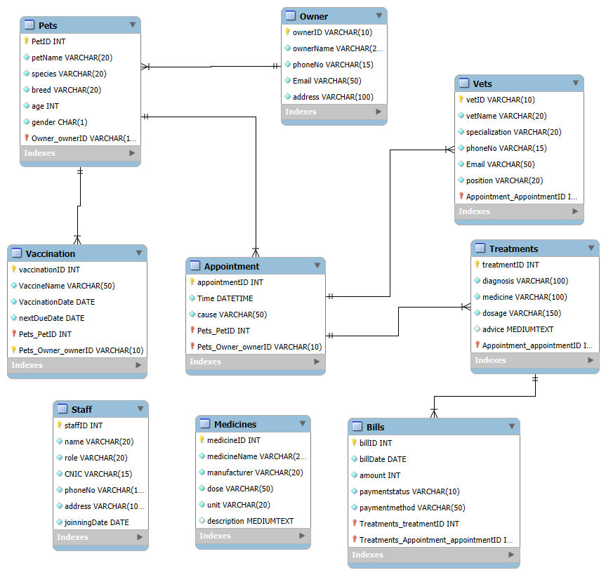

# VetClinic_DB
Here is a complete structure of database for a Veterinary Clinic.
# 🐾 VetClinic Database Management System

This project is a fully functional relational database system designed to manage operations in a veterinary clinic. It handles data related to pet owners, pets, appointments, treatments, billing, and vaccinations. The project includes an ERD, SQL schema, sample data, and stored procedures.

---

## 📁 Project Contents

- `VetClinic_Schema.sql` – Contains:
  - Table creation (DDL)
  - Primary and foreign key constraints
  - Sample data (`INSERT INTO` statements)
  - Stored procedures for common operations (insert, update, delete)
  
- `VetClinic_ERD.png` – Visual representation of the entity-relationship diagram (ERD)

- `README.md` – Project overview and documentation

---

## 🧱 Database Tables

| Table         | Description                                  |
|---------------|----------------------------------------------|
| `Owner`       | Stores owner details (name, address, contact) |
| `Pets`        | Pet information including species and breed  |
| `Veterinarian`| Vet details and specialization               |
| `Appointment` | Appointment records between pets and vets    |
| `Treatments`  | Records of treatments given during appointments |
| `Bills`       | Billing details for treatments and appointments |
| `Vaccinations`| Vaccination records for pets                 |

---

## 🔗 Entity Relationships

- One **Owner** can have many **Pets**
- One **Pet** can have multiple **Appointments**
- One **Appointment** is assigned to one **Veterinarian**
- Each **Appointment** can result in multiple **Treatments**
- **Bills** are linked to **Treatments**
- Each **Pet** can have multiple **Vaccinations**

---

## 🛠️ Technologies Used

- **DBMS:** Microsoft SQL Server
- **Design Tool:** MySQL Workbench (for ERD)
- **Language:** SQL (DDL, DML, Stored Procedures)

---

## ⚙️ Key Features

- Properly normalized schema (1NF – 3NF)
- Use of primary and foreign keys for relational integrity
- Sample data to demonstrate functionality
- Stored procedures for:
  - Inserting new treatments
  - Updating treatments
  - selecting treatments
  - deleting treatments
  - displaying details for pet
- Clean, readable SQL script suitable for real-world application

---

## 📸 Preview

---

## 💡 How to Use

1. Open `VetClinic_Schema.sql` in your SQL Server environment.
2. Execute the file step by step (start with table creation).
3. Run the `INSERT` statements to populate the tables.
4. Test stored procedures and queries using your own data.

---

## 📄 License

This project is open-source and free to use for learning, freelancing, or academic purposes.

---

## 👤 Author

**Muhammad Afnan**  
2nd Semester BSCS Student  
Freelance SQL & Database Developer  
Fiverr Profile: [Click here](https://www.fiverr.com/muhammad_affnan)

---
